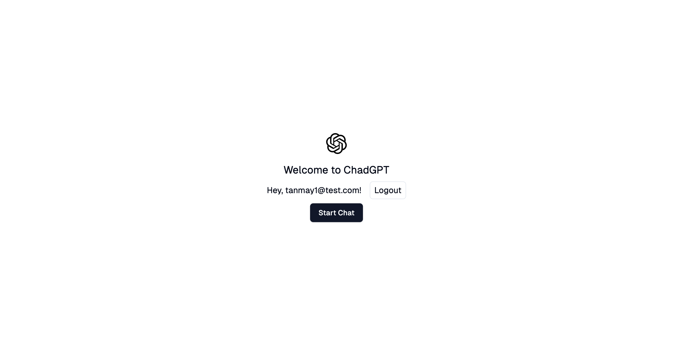

<h1 align="center">ChatGPT Clone: Next.js, Supabase</h1>

<p align="center">
 will be using OpenAI API after completion of project
</p>

<p align="center">
  <a href="#demo"><strong>Demo</strong></a> ·
  <a href="#features"><strong>Features</strong></a> ·
  <a href="#tech-stack"><strong>Tech Stack</strong></a> ·
  <a href="#clone-and-run-locally"><strong>Clone and run locally</strong></a> ·
  <a href="#feedback-and-issues"><strong>Feedback and issues</strong></a>
</p>

<br/>

## Demo

You can view a fully working demo [here](https://chatgpt1-clone.vercel.app).

You can this dummy account also:

 📧 tanmay1@test.com

 🔐 Tanmay123

## Features

I couldn't complete the project. In few weeks, I'll make the clone complete with all possible feautures from original chatgpt.

- As of now

  - User Authentication
  - New Chat
  - Send Message
  - No connection to OpenAI currently
  - Need to subcription for realtime data manipulation

## Tech Stack

- Nextjs
- Tailwind
- Supabase
- Shadcn/ui

## Clone and run locally

#### Pre-requisites

- Node Installed
- You'll first need to create a Supabase project [via the Supabase dashboard](https://database.new)

1. Clone the repo and enter to the directory:

   ```bash
   git clone https://github.com/sarkartanmay393/ChatGPT-clone.git
   cd ChatGPT-clone
   ```

2. Install packages

   ```bash
   npm install
   ```

3. Rename `.env.local.example` to `.env.local` and update the following:

   ```bash
   NEXT_PUBLIC_SUPABASE_URL=[INSERT SUPABASE PROJECT URL]
   NEXT_PUBLIC_SUPABASE_ANON_KEY=[INSERT SUPABASE PROJECT API ANON KEY]
   ```

   Both `NEXT_PUBLIC_SUPABASE_URL` and `NEXT_PUBLIC_SUPABASE_ANON_KEY` can be found in [your Supabase project's API settings](https://app.supabase.com/project/_/settings/api).

4. You can now run the Next.js local development server:

   ```bash
   npm run dev
   ```

   The app should now be running on [localhost:3000](http://localhost:3000/).

## Feedback and issues

Please file feedback and issues over on the [Project's Issue Section](https://github.com/sarkartanmay393/ChatGPT-clone/issues/new).

Thanks you for visiting to my project. 🧡
